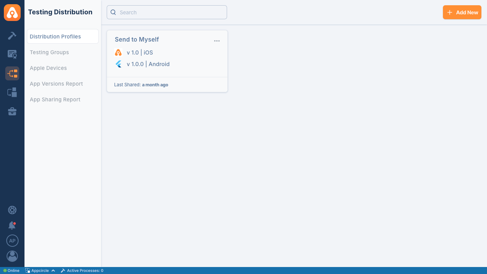
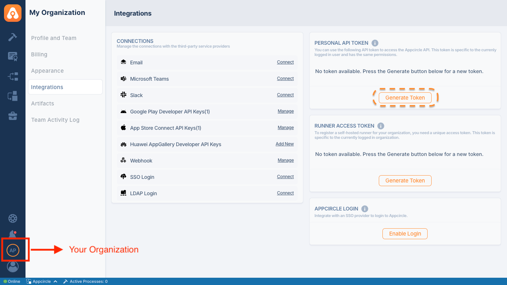
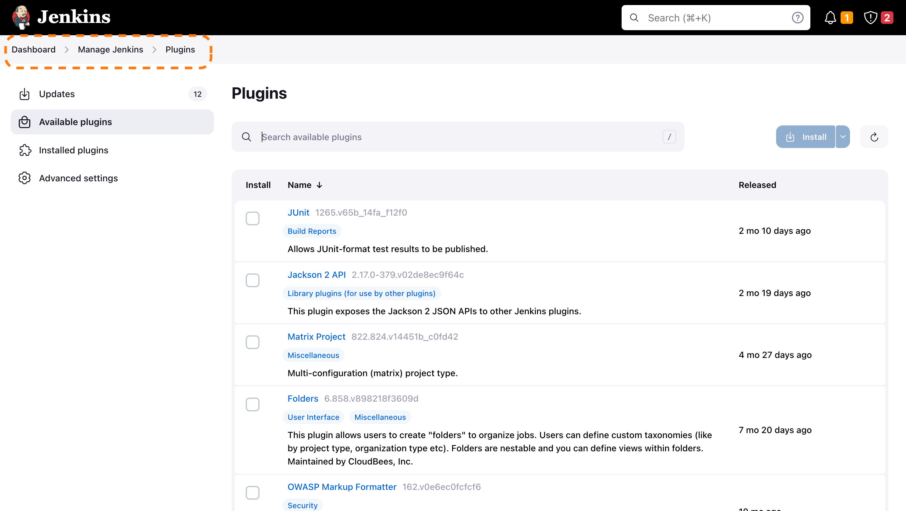
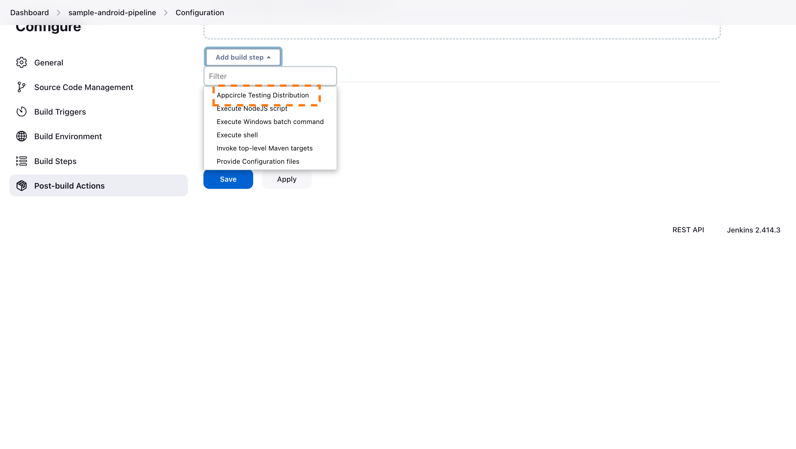

# Appcircle Testing Distribution

Appcircle simplifies the distribution of builds to test teams with an extensive platform for managing and tracking applications, versions, testers, and teams. Appcircle integrates with enterprise authentication mechanisms such as LDAP and SSO, ensuring secure distribution of testing packages. Learn more about Appcircle testing distribution. Learn more about [Appcircle testing distribution](https://appcircle.io/testing-distribution)

Appcircle's test distribution extension enables developers to create test groups and share builds with them, utilizing enterprise-grade authentication methods. With the Jenkins Extension, this module will be accessible directly from your pipeline.

## Exploring Testing Distribution

Testing distribution is the process of distributing test builds to designated test groups or individuals. This process allows developers to gather quick feedback, identify bugs, and ensure the quality of software applications before releasing them to customers. Appcircle's test distribution module enables developers to create test groups and share builds with them, utilizing enterprise-grade authentication methods.

## Benefits of Using Testing Distribution

1. **Simplified Binary Distribution**.
   - **Skip Traditional Stores:** Share .xcarchive .IPA, APK, AAB, Zip, files directly, avoiding the need to use App Store TestFlight or Google Play Internal Testing.
2. **Streamlined Workflow:**
   - **Automated Processes:** Platforms like Appcircle automate the distribution process, saving time and reducing manual effort.
   - **Seamless Integration:** Integrates smoothly with existing DevOps pipelines, enabling efficient build and distribution workflows.
3. **Enhanced Security:**
   - **Controlled Access:** Set specific permissions for who can access the test builds using enterprise authentication methods such as LDAP & SSO.
   - **Confidentiality:** Ensures that only authorized testers have access to the builds, protecting sensitive information.
4. **Efficient Resource Management:**
   - **Targeted Testing:** Allows the creation of specific test groups, ensuring that the right people are testing the right features.
   - **Optimized Testing:** Helps in allocating resources effectively, leading to better utilization of testing resources.
5. **Reduced Time to Market:**
   - **Eliminates Approval Delays:** By bypassing store approval processes, developers can distribute builds directly to testers, speeding up the testing cycle.
   - **Continuous Delivery:** Supports continuous delivery practices, enabling faster iterations and quicker releases.
6. **Faster Feedback Loop:**
   - **Quick Issue Identification:** Distributing test builds quickly allows developers to gather immediate feedback, identify bugs, and address issues early in the development cycle.
   - **Improved Quality:** Continuous testing helps ensure the software meets quality standards before release, reducing the likelihood of post-release issues.
7. **Cost-Effective:**
   - **Reduced Overheads:** Automating the distribution reduces the need for manual intervention, cutting down operational costs.
   - **Efficient Bug Fixes:** Early detection and fixing of bugs prevent costly fixes later in the development process.
8. **Enhanced User Experience:**
   - **Better Quality Control:** Ensures that end users receive a more stable and polished product.
   - **Customer Satisfaction:** By delivering higher quality software, customer satisfaction and trust in the product increase.

Overall, using testing distribution in mobile DevOps significantly enhances the efficiency, security, and effectiveness of the software development process, leading to better products and faster delivery times.

## Getting started

To share your builds with testers, you can create distribution profiles and assign testing groups to these profiles.

### Testing Distribution

In order to share your builds with testers, you can create distribution profiles and assign testing groups to the distribution profiles.



### Generating/Managing the Personal API Tokens

To generate a Personal API Token, follow these steps:

1. Go to the My Organization screen (the second option at the bottom left).
2. You'll find the Personal API Token section in the top right corner.
3. Press the "Generate Token" button to generate your first token.



### Install Appcircle Testing Distribution Plugin

Go to your Jenkins dashboard and follow, Manage Jenkins > Plugins and search for "Appcircle Testing Distribution"



### Add Plugin in Build Steps

Go to your configuration page of the project add a build step.



### Configure Plugin

After adding the plugin into your build steps make sure you fulfill required inputs.
Also, do not forget to add the plugin after your build steps. Because you will be asked to provide the build path.

### Leveraging Environment Variables

Utilize environment variables seamlessly by substituting the parameters with `$(VARIABLE_NAME)` in your task inputs. The extension automatically retrieves values from the specified environment variables within your pipeline.

Efficiently distribute test binaries or beta versions using Appcircle, featuring seamless IPA and APK distribution capabilities. Streamline your testing process with our versatile tool designed to optimize your distribution workflow. If you need support or more information, please [contact us](https://appcircle.io/contact)

### Using Plugin into Your Script

```Groovy
   stage('Publish') {
      environment {
         AC_PAT = credentials('AC_PAT')
      }
       steps {
           appcircleTestingDistribution accessToken: hudson.util.Secret.fromString('AC_PAT'),
                   profileID: 'PROFILE_ID',
                   appPath: 'APP_PATH',
                   message: 'MESSAGe'
       }
   }
```

### Reference

- For details on generating an Appcircle Personal Access Token, visit [Generating/Managing Personal API Tokens](https://docs.appcircle.io/appcircle-api/api-authentication#generatingmanaging-the-personal-api-tokens)

- To create or learn more about Appcircle testing and distribution profiles, please refer to [Creating or Selecting a Distribution Profile](https://docs.appcircle.io/distribute/create-or-select-a-distribution-profile)

## Issues

Report issues and enhancements at info@appcircle.io

## LICENSE

Licensed under MIT, see [LICENSE](LICENSE.md)
